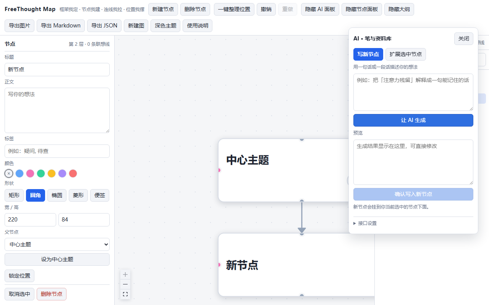

# FreeThought Map（自控思维网）

> 一句话定位：**框架我定，节点我建，连线我拉，位置我摆；AI 只是笔和资料库，不是老师。**

一个完全由用户主导的视觉思考工具。骨架基于标准思维导图（中心主题 + 层级分支），但节点创建、连线决策、位置摆放全部由用户掌控。



## 快速开始

```bash
npm install
npm run dev        # 打开 http://localhost:5180
```

其他脚本：`npm run build`（类型检查 + 打包到 dist/）、`npm run preview`（预览打包产物）、`npm run typecheck`。

- 数据默认存在浏览器 localStorage，无账号、无后端、不上云；「导出 JSON」即全量备份。
- AI 功能是**可选**的：在 AI 面板 →「接口设置」填入任意 OpenAI 兼容的 Base URL 与 API Key（只存本机，不进代码库）。不配置也能手动建节点、拉线、摆位置。

---

## 1. 项目目标与核心原则

### 1.1 项目目标

做一个**完全由用户主导的视觉思考工具**。

- 逻辑骨架仍是标准思维导图：一个中心主题向外长出分支与子分支，层级清晰，能一眼看清脉络。
- 在骨架之上，**节点、连线、摆放位置全部由用户决定**。
- 让零散想法通过自由连线与自由摆放，边想边画、逐步生长，最终汇流成一张**由用户掌控的网状脉络图**——而不是 AI 替用户决定脉络。

### 1.2 核心原则

- **AI 绝对被动**：仅在用户明确调用时生成/补充节点文本内容，绝不自动建节点、自动连线、自动布局、自动引导或自动整理。
- **两种连线并存**：
  - **Tree 边**：有向父子关系，决定大纲结构。
  - **自由联想线**：无类型、无标签、不影响布局，仅表达"我认为有关联"，可任意节点互连。
- **位置完全自由**：拖拽只改视觉坐标，不改变逻辑父子关系。提供可选的一键 Tree 布局辅助，但非强制。
- **边想边画、逐步生长**：可用自然语言描述让 AI 生成节点内容，也可完全手动创建。
- **最终产物**：用户可控的网状/树状混合脉络图，而不是 AI 替用户决定结构的固定树。

### 1.3 交互准则（明确的体验取向）

- **语言优先**：以"一句一句的描述"或"一段话"作为主要输入方式形成节点内容，而不是逼用户去摆弄节点控件。像 ComfyUI 那样以节点方式组织思考，但操作入口偏向"说人话"。
- **跟得上思考节奏**：本地操作（建节点、拖拽、连线）即时响应；AI 调用异步进行，结果以预览形式出现，绝不阻塞画布。
- **边想边画、逐步生长**：随时可停、可接着长，不要求一次想清楚。
- **明确不做**：不做"一次性把 Markdown 转成固定树状图"式的自动成图；不做花哨但无助于思路的样式与动画。

---

## 2. 目录结构

```
freethought-map/
├── screenshots/                # 界面截图
├── src/
│   ├── main.tsx                # 入口
│   ├── App.tsx                 # 根组件
│   ├── components/
│   │   ├── Canvas/             # 主画布（React Flow 封装）
│   │   ├── Node/               # 自定义节点组件
│   │   ├── Edge/               # Tree 边 + 自由联想边
│   │   ├── Toolbar/            # 工具栏（新建、布局、导出等）
│   │   ├── Inspector/          # 节点属性面板（标题/正文/父节点/形状/宽高）
│   │   ├── AIPanel/            # AI 调用面板（可拖动浮窗，仅用户主动触发）
│   │   ├── Sidebar/            # 大纲视图 / 搜索
│   │   └── Help/               # 使用说明浮层（原生 <dialog>，收纳所有详细文字规则）
│   ├── stores/                 # 状态管理（Zustand 推荐）
│   │   ├── mapStore.ts         # 节点、边、布局状态
│   │   ├── aiStore.ts          # AI 调用状态
│   │   └── themeStore.ts       # 主题（白色默认 / 深色可切），写 <html data-theme>
│   ├── hooks/                  # 自定义 hooks（拖拽、快捷键等）
│   ├── utils/                  # 布局算法、导出、序列化
│   ├── types/                  # TypeScript 类型定义
│   ├── services/               # AI API 调用封装
│   └── styles/
├── package.json
├── tsconfig.json
├── vite.config.ts
├── README.md                   # 项目说明书（需求 + 实现 + 每轮迭代记录）
├── 开发日志.md                  # 逐条目开发日志（含踩坑与决策）
├── 测试用例.md                  # 功能测试目录与 122 条用例
└── LICENSE                     # MIT 协议
```

---

## 3. 入口文件

| 文件 | 职责 |
| --- | --- |
| `src/main.tsx` | 应用启动入口 |
| `src/App.tsx` | 整体布局（画布 + 侧边栏 + 工具栏） |
| `index.html` | HTML 入口 |

---

## 4. 核心模块

### 4.1 画布引擎（React Flow / xyflow）

- 自由定位节点
- 支持自定义节点与自定义边
- 缩放、平移、框选、多选

### 4.2 节点系统

- 手动创建空节点
- 自然语言描述 → 调用 AI 生成内容（**用户确认后**才真正落盘）
- 节点属性：标题、正文、标签、颜色、折叠状态等
- **形状可选**：矩形 / 圆角矩形 / 椭圆 / 菱形 / 便签（只改外观，不改逻辑关系）
- **大小可调**：两条路径改的是同一份宽高——① 属性面板里填宽高数值（默认 220 × 84，留空即用默认）；② **选中节点后直接拖四角/四边的缩放手柄**（`NodeResizer`，范围 80×40 ~ 800×800，与面板输入一致）
- **缩放只算一条历史**：整段拖拽期间不进历史，松手才落一条 `past`，一次 Ctrl+Z 撤回整次缩放（含左上/上边缩放带来的位移）
- 支持双击编辑；**右键轻点节点 = 弹菜单**（按住右键拖动则是平移画布，见 §4.4）
- **属性面板（节点面板）是「选中节点的属性编辑器」**：有选中才出现，没有选中就整栏不渲染（不占宽度、不留空骨架，见 §9.10）

### 4.3 双连线系统

两种边的类型**由锚点方向决定**，没有"连线模式"开关——像 draw.io 一样，从哪儿拉出就是哪种边：

| 锚点位置 | 拉出的边 | 性质 |
| --- | --- | --- |
| 节点**下/上**方锚点（灰蓝） | **Tree 边** | 有向父子关系，决定大纲结构与层级 |
| 节点**左/右**方锚点（粉色） | **自由联想线** | 无向、无标签，纯视觉关联，不参与布局计算 |

- 画布开启 `ConnectionMode.Loose`，同一锚点既可连出也可连入
- 用户只需"从哪儿拉"这一个动作，无需先选模式再连线
- **Tree 边的进出边由两节点相对位置自动决定**（`AutoTreeEdge` 自定义边）：取两个节点的中心连线与自己矩形边框的交点，交点落在哪条边就从哪条边进出（上/下/左/右）。子节点在父节点上方、左方、右方都能贴最近的一侧走，不会绕圈；节点位置一变连线立刻跟着变
- 生成边时仍显式写锚点（`'b'` / `'t'`），但那只是为了让 React Flow 能解析出这条边（取不到 handle 就不渲染边）；实际画线坐标由 `AutoTreeEdge` 覆盖，不再固定走"父底 → 子上"
- **两种边都是"点一下即断"**：点灰色父子线 → 断开这条父子关系；点粉色联想线 → 删掉这条联想。都不弹二次确认，Ctrl+Z 都能找回
- **断开就是真的断开**：父子线断开后，子节点变成**独立节点**（`parentId = null`），位置不动、内容不动、**不自动重挂到任何地方**；一个节点与周围全部断开后就是孤立的独立节点。因此**全图允许存在多个顶层节点**，载入旧存档时也不再做任何自动归一
- **断线 / 加线的入口都有两条**：画布上（点线断、拖锚点连）+ 节点面板（父节点下拉选「独立节点（无父节点）」等价于断线）
- **锚点热区比圆点大**：圆点视觉上仍是 9px，但用透明 `::after` 把可拖拽命中区撑大（约 25px），悬停时圆点放大 + 光晕，上下锚点灰蓝光晕、左右锚点粉色光晕，明确"这里能拉线"

### 4.4 布局与位置控制

- 默认完全自由拖拽
- **同一张图内允许混搭摆放**：局部放射状/树状、局部网状，随用户心意，不做任何统一约束
- 可选一键 Tree 布局（**仅调整视觉位置，不改逻辑关系**，且可 Ctrl+Z 撤回；锁定节点不受影响）
- 支持锁定/解锁节点位置；锁定后节点**右下角**显示一个**透明白色小锁**（不占文字区，随节点形状走），不再用文字提示
- **左键拖空白 = 框选**（选框盖住的节点一起选中），Shift / Ctrl 点选 = 加选，点空白 = 取消选中
- **右键按住拖动 = 平移画布**（中键拖动亦可）；**右键轻点节点 = 弹节点菜单**（位移 ≤ 5px 才算轻点，超过即按平移处理，不弹菜单）；**键盘方向键**同样平移视口（上下左右各 60px，聚焦输入框时让位给光标）
- Delete 与 Backspace 均可批量删除选中节点；删除父节点时子节点自动上提一级，不连带丢内容
- **新建节点的落点不是写死的**：该父节点下还没有子节点时落在父节点正下方一行；已有子节点时排到**最右侧兄弟的右边**（间隙 40），绝不与兄弟重叠。落点**只计算这一个新节点的坐标，不移动任何已有节点**——"位置我摆"原则不破

### 4.5 AI 交互模块

- 严格遵循"用户主动调用"原则
- **面板是可自由拖动的浮窗**：拖标题栏即可移动，位置记入本地并在刷新后恢复，不占用画布宽度
- 能力范围：
  - **笔**：根据描述生成节点内容、扩展某个节点、总结选中节点
  - **资料库**：就选中节点/描述做资料查询与参考补充（同样只是给定文本，由用户决定是否采纳）
- 生成结果**先预览**，用户确认后再写入画布
- 任何情况下不拟定结构、不追加连线、不调整位置

### 4.6 数据持久化

- 本地优先（IndexedDB / localStorage）
- 支持导出/导入：JSON（完整状态）、Markdown 大纲、图片
- **导出是单向产物**：Markdown 仅作为大纲输出，不做反向的"Markdown → 固定树"自动成图

### 4.7 辅助功能

- 大纲同步视图
- 搜索与过滤
- 快捷键
- 撤销/重做
- **使用说明浮层**（工具栏「使用说明」按钮）：所有详细文字规则的**唯一归口**，界面本身只保留最小必要文案
- **主题切换**（工具栏「深色主题 / 白色主题」按钮）：白色为默认，点一下切到深色，选择记进 `localStorage`；全部颜色集中在 [index.css](file:///e:/FreeThought%20Map/src/styles/index.css) 的两套 CSS 变量里，两主题文字对比度均达 WCAG AA（见 §9.11）

---

## 5. 技术栈

| 层级 | 推荐技术 | 说明 |
| --- | --- | --- |
| 框架 | React 18 + TypeScript + Vite | 现代、类型安全、快速开发 |
| 节点画布 | React Flow (xyflow) | 成熟、高度可定制、支持自由定位与自定义边 |
| 状态管理 | Zustand | 轻量、适合复杂画布状态 |
| 样式 | Tailwind CSS + CSS Modules | 快速、灵活 |
| AI 调用 | OpenAI / Claude / 国产大模型 API | **仅用户触发时调用** |
| 本地存储 | IndexedDB（via idb 或 Dexie） | 支持较大项目持久化 |
| 布局辅助 | d3-hierarchy 或自写简单树布局 | **仅作可选一键整理** |
| 构建与工具 | Vite、ESLint、Prettier | — |

> 备选方案：若追求更轻量或更极致性能，可考虑 Svelte + 自研 Canvas/SVG，但 React Flow 开发效率明显更高。

---

## 6. 约束条件

- AI 绝对被动：任何自动行为（自动建节点、自动连线、自动布局、自动建议结构）**一律禁止**。
- 拖拽只改视觉位置，不改变 Tree 父子关系。
- 自由联想线不影响任何布局与层级计算。
- 数据本地优先，默认不上传云端（可后期加可选同步）。
- 首版聚焦核心交互，不做复杂协作、不做过度花哨动画。
- 界面语言优先中文，支持后续国际化。
- 性能要求：单图支持至少 **300+ 节点**流畅操作。

### 不做清单（Non-Goals）

| 不做 | 原因 |
| --- | --- |
| 自动建节点 / 自动连线 / 自动布局 / 自动建议结构 | 结构权必须 100% 归用户 |
| 一键把 Markdown/长文转成固定树状导图 | 正是要摆脱的"AI 替我定脉络" |
| 自动整理、自动归类、自动补全层级 | 同上 |
| 花哨样式与炫技动画 | 无助于思路，干扰节奏 |
| 首版的多人协作、云同步 | 聚焦单机核心交互 |

---

## 7. 验收标准

> 本节 16 条已于 2026-09-18 由第四轮全功能自动化验证逐条实测通过，全量证据见 §9.4；第 16 条为 2026-09-19 第九轮追加（见 §9.9）。

- [x] 可创建中心主题，手动添加子节点，建立 Tree 父子关系（可「设为中心主题」换根；主动断开后子节点即独立节点，**全图允许多个顶层节点**）
- [x] 任意两个节点之间可拉自由联想线
- [x] 节点可完全自由拖拽，位置持久化
- [x] 提供一键 Tree 布局，且布局后仍可继续自由拖拽（可撤回，锁定节点不动）
- [x] 节点形状可选（矩形 / 圆角矩形 / 椭圆 / 菱形 / 便签），大小既可在属性面板填数值，也可选中后拖四角/四边手柄直接缩放（整次缩放只记一条历史）
- [x] 用户输入描述后，主动调用 AI 生成节点内容，并需用户确认才写入
- [x] AI 在任何情况下都不会自动创建节点或连线
- [x] 支持导出 JSON（完整状态）与 Markdown 大纲
- [x] 本地刷新后状态完整恢复
- [x] 基础快捷键与右键菜单可用（含左键拖空白框选、右键轻点弹菜单 / 右键拖动平移、方向键平移、多选、Delete/Backspace 批量删除）
- [x] 界面清晰，无明显卡顿（100 节点级；321 节点实测见 §9.2）
- [x] 同一张图内可混搭摆放（局部树状/放射状 + 局部网状），无任何强制归整
- [x] 具备"语言优先"入口：写下描述即可让 AI 给出节点文本，全程无需进入节点控件
- [x] AI 调用期间画布仍可正常拖拽、连线、编辑（不阻塞思考流）
- [x] 全应用不存在任何一键自动成图/自动转树的入口
- [x] 界面只保留最小必要文案（**无任何常驻长句说明**）；详细规则集中在工具栏「使用说明」浮层，按钮与字段的补充说明一律走悬停 `title`
- [x] 提供**白色（默认）与深色两套主题**，工具栏一键切换并记住选择；两主题下正文与次要文字对比度均达 WCAG AA（≥4.5:1）

---

## 8. 待解决的设计问题

1. React Flow 对**"逻辑层级与视觉位置完全解耦"**的支持需要仔细设计（尤其是 Tree 边与自由边并存时）。
2. AI 生成结果如何优雅地预览与确认，避免打断思考流。
3. 自由联想线过多时如何保持画面可读性（透明度、可折叠、过滤等）。
4. 移动端/触屏支持优先级待定（首版可先聚焦桌面）。

---

## 9. 下一步任务（开发路线）

按依赖顺序排列，一次只做一件事：

| 顺序 | 任务 | 依赖 |
| --- | --- | --- |
| 1 | 确认技术选型（React + React Flow + Zustand） | — |
| 2 | 搭建基础脚手架（Vite + React + TS + Tailwind + React Flow） | 1 |
| 3 | 设计核心数据模型（`Node`、`TreeEdge`、`FreeEdge`、`Position` 等） | 1 |
| 4 | 实现最小可行画布：创建中心节点 / 手动添加子节点（Tree 边）/ 自由拖拽 / 添加自由联想线 | 2, 3 |
| 5 | 实现本地持久化（保存/加载） | 4 |
| 6 | 加入 AI 调用面板（最简版：选中节点 + 描述 → 生成内容预览 → 确认写入），并落地"语言优先"输入入口 | 4 |
| 7 | 增加可选一键 Tree 布局按钮 | 4 |
| 8 | 编写基础 README 与使用说明 | 全部 |

### 9.1 实施状态（2026-09-17）

第 1–8 步已全部落地，工程可运行：`npm run dev` → http://localhost:5180（`npm run typecheck` 与 `npm run build` 均通过）。

第二轮已补齐首轮遗留的全部功能缺口：节点编辑面板、右键菜单、PNG 图片导出、搜索与过滤、快捷键修正。

实现与本文档存在 3 处偏差，均为「减少依赖、最小可用」的取舍，须在接力开发时知悉：

| # | 偏差 | 落地方式 | 原因 / 后续 |
| --- | --- | --- | --- |
| 1 | 样式方案 | 未引入 Tailwind / CSS Modules，改用单文件原生 CSS `src/styles/index.css` | 少一层构建依赖；后续要换 Tailwind 只需替换该文件 |
| 2 | 本地存储 | 首版用 `localStorage`（300ms 防抖），未用 IndexedDB | `src/utils/doc.ts` 已用 `ponytail:` 标注约 5MB 天花板与升级路径 |
| 3 | 树布局算法 | 未引入 `d3-hierarchy`，自写两趟 tidy-tree（O(n)）于 `src/utils/layout.ts` | 单层需求够用；如需更紧凑的 Reingold–Tilford 再替换 |

### 9.2 第二轮补充（2026-09-17）

| 能力 | 落地位置 | 说明 |
| --- | --- | --- |
| 节点编辑面板（Inspector） | `src/components/Inspector/Inspector.tsx`，挂载于 `App.tsx` 左栏 | 标题 / 正文 / 标签 / 颜色 / 锁定 / 父节点切换（走 `setParent`，含防环提示）/ 联想线列表与删除 |
| 文本连续输入只记 1 条历史 | `mapStore` 的 `beginEdit` / `updateNodeLive` / `endEdit` | 聚焦开快照、输入实时写、失焦用引用比较判断「无变化不记历史」 |
| 右键节点菜单 | `src/components/Canvas/Canvas.tsx` | 新建子节点 / 新建同级节点 / 锁定位置 / 删除节点；全部需用户点击，无自动行为 |
| PNG 图片导出 | `src/components/Toolbar/Toolbar.tsx` | `html-to-image` 的 `toPng` + `getNodesBounds` 重摆视口，导出结果与当前缩放平移无关 |
| 搜索与过滤 | 工具栏搜索框 → `mapStore.query`；大纲 `OutlineView` 与画布 `.tnode.is-match` 联动 | 命中集合只用于高亮/灰显，不改任何数据；大纲点选前自动展开祖先 |
| 快捷键 | `src/hooks/useHotkeys.ts` | Ctrl/Cmd+Z 撤销、Shift+Z 重做、Tab 建子节点、Enter 建同级节点、Delete/Backspace 批量删除、Esc 取消选中；输入框内一律不响应（§9.3 已恢复 Backspace，改为配合框选多选使用） |

**性能实测（321 节点）**：批量新建 301 节点 150ms；一键 Tree 布局 51ms；真实鼠标拖拽 60 次 `mousemove` 净耗时约 38ms（含 62ms 帧基线）。满足 §7 的 300+ 节点流畅目标。

### 9.3 第三轮修订（用户实操反馈，2026-09-17）

用户上手实操后提了 9 条反馈，逐条落地如下（对照「用户反馈编号」）：

| # | 用户反馈 | 结论与落地方式 | 主要文件 |
| --- | --- | --- | --- |
| ① | 左下角白色色块是什么 | 是 React Flow 内置 `Controls`（缩放/适配按钮），默认浅色白底在深色画布上突兀 → 统一覆盖为深色 | `src/styles/index.css` |
| ② | 连线模式那行字选了就该隐藏，别摆在那儿 | **整块删除**"连线模式"胶囊与 `LinkMode` 概念，不再有需要常驻显示的当前模式 | `src/styles/index.css`、`src/types/index.ts` |
| ③ | 点「新建图」变成空白页 | 建图/载图/整理后没有把视口对上去 → 新增 `fitSignal` 计数器，store 递增、Canvas 订阅后 `fitView()` | `mapStore`、`Canvas.tsx` |
| ④ | 一键 Tree 布局是啥、做了没 | 已实现（自写 tidy-tree，见 §9.1 偏差 3），本轮补充：**可 Ctrl+Z 撤回**、锁定节点跳过 | `src/utils/layout.ts`、`mapStore.applyTreeLayout` |
| ⑤ | 节点形状大小想自己拉 | 形状加**矩形 / 圆角矩形 / 椭圆 / 菱形 / 便签**；大小两条路径：面板填宽高数值、**选中后拖四角/四边手柄直接拉**（`NodeResizer`，范围与面板一致）| `Inspector.tsx`、`ThoughtNode.tsx`、`Canvas.tsx`、`types/index.ts` |
| ⑥ | AI 面板位置不满意、不能移动 | 改为**可拖动浮窗**（`position: fixed` + 拖标题栏），位置写入 `localStorage` 并带边界钳制，刷新后恢复 | `AIPanel.tsx`、`App.tsx`、`index.css` |
| ⑦ | 「顶层节点」选择看不懂 | 父节点下拉删掉「（顶层节点）」，改为「设为中心主题」；换根时原中心主题挂到新根下（⚠️ **本条原附带的「全图只保留唯一中心主题 + 载入时 `ensureSingleRoot` 归一」已于 §9.5 推翻**——用户要求"断开就是真断开，能成为独立节点"，现有的唯一根约束已删除） | `Inspector.tsx`、`mapStore.setRoot` |
| ⑧ | 连线不自由、还要先点模式，父子线/联想线分不清 | 改为 **draw.io 范式：锚点方向决定类型** —— 上下锚点（灰蓝）= Tree 父子线，左右锚点（粉色）= 自由联想线，配 `ConnectionMode.Loose`；模式按钮彻底删除 | `ThoughtNode.tsx`、`Canvas.tsx`、`index.css` |
| ⑨ | 不能整片选中、不能按 Delete 删 | 框选 + 多选重构：`selectedId` → `selectedIds[]`；**拖空白即框选**（`selectionOnDrag` + `panOnDrag={[1]}`，平移走中键/空格），Shift/Ctrl 加选，Delete 与 Backspace 均可批量删除（⚠️ **本条的手势方案先被 §9.8 推翻（拖空白=平移、Shift+拖=框选），又被 §9.12 二次推翻——当前为「左键拖空白=框选、右键拖动=平移画布」**） | `mapStore`、`Canvas.tsx`、`useHotkeys.ts` |

**实测证据（Playwright 端到端，dev server @5180）**

| 项 | 断言 | 结果 |
| --- | --- | --- |
| ①② | 画布无白色控件块、DOM 中不存在 `.canvas-mode` | ✅ |
| ③ | 新建图后画布显示「中心主题」而非空白 | ✅ |
| ④ | 整理后 `中心主题:0,174 / 新节点:0,0`，Ctrl+Z 回到 `0,0 / 40,120` | ✅ |
| ⑤ | 选椭圆 + 填 200 × 130，节点变椭圆且尺寸生效 | ✅ |
| ⑤-拖拽 | 未选中时 0 个缩放手柄；选中后 8 个（四角 + 四边）；右下角手柄拖 +160/+80 屏幕像素（zoom 2）→ 80×84 变 160×124，面板同步显示 160/124 | ✅ |
| ⑤-位移 | 左上角手柄拖 −60/−30 → 尺寸 160×124 变 190×139 且 `position` 由 (−40.5,34.5) 变 (−70.5,19.5)，对角固定 | ✅ |
| ⑤-历史 | 上述两次缩放各按一次 Ctrl+Z 即整段还原（含位移），确认一次缩放只落一条 `past` | ✅ |
| ⑤-持久化 | 缩放后 `localStorage` 落盘 `"width":160,"height":124`，刷新页面尺寸保持 | ✅ |
| ⑥ | 面板 `position: fixed`；拖拽后 `localStorage` 写入 `{"x":572,"y":382}`，刷新后面板回到 (572,382) | ✅ |
| ⑦ | 「设为中心主题」后 `roots === 1`，原中心主题挂到新根下 | ✅ |
| ⑧ | 从右侧粉锚点拉出 → `{edges:4, free:1}`，得到粉色虚线联想线 | ✅ |
| ⑨ | 拖空白框选 4 个节点，Inspector 显示「选中 4 个」；Delete/Backspace 批量删除且子节点上提不丢 | ✅ |

**已知行为（刻意保留，非缺陷）**：允许把包括中心主题在内的节点全部删光，画布变空白，此时 Ctrl+Z 可撤回；若在空图上点「新建节点」，新节点会自动成为新的根。这是"结构权 100% 归用户"的直接后果，不做禁止性拦截。缩放同理：椭圆/菱形的缩放手柄贴的是**外接矩形**（手柄恒为四角四边的方框，不会跟着转成菱形），因为宽高就是数据的全部尺寸语义，不为形状单独引入尺寸模型。

---

### 9.4 第四轮：全功能自动化验证（2026-09-18）

用户要求「自动操作网页端所有得功能都需要验证一遍」。本轮用 Playwright 驱动浏览器对 dev server（http://localhost:5180）把**全部交互路径**逐项跑通，覆盖 **9 组、70+ 项断言，全部通过**。本轮**未改动任何业务代码**，只做验证与落档（详见 `开发日志.md` 条目 6）。

| 组 | 覆盖功能 | 结果 |
| --- | --- | --- |
| A 基础 | 页面加载、初始中心主题、布局（未选中=画布+大纲两栏；选中节点后节点面板自动出现，见 §9.10）、控制台无报错 | ✅ |
| B 工具栏 | 12 个按钮全部生效（新建/删除/一键整理/撤销/重做/AI 面板/节点面板/大纲/导出图片/导出 Markdown/导出 JSON/新建图） | ✅ |
| C 画布 | 拖拽移动、框选、Shift 加选、缩放平移、双击改名、父子线与联想线两类连线、点线删除、右键菜单 4 项、点空白取消选中 | ✅ |
| D 节点外观 | 5 种形状、面板填充宽高、8 个缩放手柄拖拽（深色、对角固定、整次缩放一条历史、持久化） | ✅ |
| E 节点面板 | 标题 / 正文 / 标签 / 6 色 / 父节点 / 设为中心主题 / 锁定 / 折叠 / 联想线删除 / 成环提示 / 无选中即不渲染（§9.10 起） | ✅ |
| F 快捷键 | Ctrl+Z、Ctrl+Shift+Z、Ctrl+Y、Tab、Enter、Delete/Backspace、Escape；**聚焦输入框时全部不拦截** | ✅ |
| G 大纲 | 树形折叠、点选跳转并自动展开祖先、搜索过滤高亮（标题/标签/正文三路）、无命中提示、清除 | ✅ |
| H AI 面板 | 浮窗拖拽 + 边界钳制 + 位置记忆、模式切换、空 prompt 与未配置提示、确认写入新节点、expand **追加不覆盖**、设置保存 | ✅ |
| I 持久化 | 刷新恢复（节点/尺寸/派生 Tree 边/大纲）、AI 位置与配置恢复、撤销栈跨刷新清空、新建图（取消/确认/可撤销）、测试数据清理 | ✅ |

**控制台结论**：无任何 `error`。三类 warning 已逐条定性——隐藏 attribution 与合成拖拽的 "not initialized" 均为**非缺陷**（后者用真实 `playwright_drag` 复跑后不再出现）；`exportPNG` 直接 import `getNodesBounds` 触发的用法提示**已修复**（改从 `useReactFlow()` 解构，见 `开发日志.md` 条目 7），修复后 PNG 导出回归通过、该提示消失。

**验证方法要点**（供后续自动化接手）：React Flow 的合成事件必须按组件真实监听类型派发——d3-drag 拖拽与 Handle 连线只认 `MouseEvent('mousedown')`，框选与 pane 点空白只认 `PointerEvent`（且 target 必须是 `.react-flow__pane` 本身，并屏蔽 `setPointerCapture` 系列），双击改名要打在 `.tnode` 内层，React `onBlur` 实际监听 `focusout`；Vite dev 下 `import('/src/stores/mapStore.ts')` 会拿到独立模块实例，验数须走真实 UI 或读 `localStorage`。

### 9.5 第五轮：修复「新建多个节点」两处 bug（2026-09-18）

用户从一张 30+ 节点的树截图反馈：「连线很死板全部从左侧绕」「落点被写死了」。定为两个独立 bug，**连线 + 落点一起改**（详见 `开发日志.md` 条目 8）：

| Bug | 根因 | 修复 |
| --- | --- | --- |
| 父子线全部从父节点左边缘甩出、绕成大弧 | 生成 Tree 边时未写锚点 id，React Flow 取节点第一个 source 锚点（左侧 `l`） | `treeEdges` 显式补 `sourceHandle: 'b'` + `targetHandle: 't'` |
| 同一父节点下连续新建的节点坐标完全相同、叠成一坨 | `addNode` 位置公式 `{x: parent.x + 40, y: parent.y + 120}` 只看父节点、不检查已有兄弟 | 新增 `dropPosition(doc, parent)`：无兄弟落父下方一行，有兄弟排最右兄弟右边（间隙 40） |

**关键取舍**：用户否决了"新建后自动局部整理"（会移动用户手动摆好的节点）。故 `dropPosition` **只算新节点自身坐标，绝不移动任何已有节点**。

**验证**：`tsc --noEmit` EXIT=0；Playwright 连按 Enter 4 次（等 700ms 过防抖）得 4 个兄弟节点同一行、x 等差 260、零重叠（修复前为 4 个坐标全等）；SVG 边路径起点由 `M385.5,42`（父左边缘）变为 `M110,88.5`（父底边中点，父宽 220）。新增回归用例 **TC-B-14**、**TC-C-17**（用例总数 95 → **97**）。

---

### 9.6 第六轮：父子连线改为「按相对位置自动选边」（2026-09-18）

第五轮把锚点写死成「父底 → 子上」，用户带新截图反馈「**痛点还没有解决，就是这个巡线关系不会自动调整**」——节点散布很散时仍出现大量长弧。确认第五轮只治标：锚点固定后，子节点一旦不在父节点正下方（跑到上方/左方/右方），线就必须从父底出发绕半张图再钻回子上顶边。

| 项 | 内容 |
| --- | --- |
| 根因 | 锚点被钉死在「父底 → 子上」，而 `position` 完全由用户随手摆 |
| 修法 | 新增自定义边 `src/components/Edge/AutoTreeEdge.tsx`：`useInternalNode` 取两节点绝对位置与实测尺寸 → 中心连线与各自矩形边框**求交**（`kx=(w/2)/|dx|`、`ky=(h/2)/|dy|`，取小者为先碰到的边）→ 交点与所在 `Position` 交给 `getBezierPath` → `<BaseEdge>` 渲染 |
| 保留项 | `treeEdges` 的 `sourceHandle: 'b'` / `targetHandle: 't'` 保留——React Flow 取不到 handle 会**不渲染**该边；实际画线坐标由 `AutoTreeEdge` 覆盖 |

**验证**：`tsc --noEmit` EXIT=0；受控四方位用例（子节点在上/左/右/下）读 SVG 路径分别为 `M510,400→510,234`、`M400,442→300,442`、`M620,442→720,442`、`M510,484→510,700`，各自贴最近边框、零绕行；点「一键整理位置」全量重排后边端点实时重算（证明不是只在挂载时算一次）；散布链用例绕行弧线消失。改写用例 **TC-C-17**（原「锚点固定底→上」已过时）并新增 **TC-C-18**（位置变动后实时重算）；用例总数校正为 **105**（此前头部写的 97 与实际条目数不符，已按实计更正）。详见 `开发日志.md` 条目 9。

---

### 9.7 第七轮：自由断线 / 加线（2026-09-18）

用户带一张「大量跨图长弧」的截图反馈：连线自动选边的问题解决了，但**「我想自由的切断或者增加一条线的关系还做不大」**。澄清到两条决定性语义后落地（详见 `开发日志.md` 条目 10）：

| 决策点 | 用户原话 / 选择 | 落地 |
| --- | --- | --- |
| 切断的语义 | 「**断开后原关系保持不变，断开的两条没有任何关系了，假设一个节点和周围全部断开了，那就是独立节点**」 | 不做任何自动重挂/上提。断开 = `parentId` 置 `null`，**位置与内容一概不动**，节点直接成为独立节点 |
| 增加线的方式 | 「**放大锚点热区 + hover 高亮（推荐）**」 | 圆点仍 9px，用透明 `::after` 把命中区撑到约 25px；悬停放大 1.35 倍 + 光晕（上下灰蓝 / 左右粉色） |

| 改动 | 文件 |
| --- | --- |
| 画布点击即断：`onEdgeClick` 支持 `t:` 前缀边 → `setParent(edge.target, null)`；`f:` 前缀仍走 `removeFreeLink` | `Canvas.tsx` |
| `setParent(id, null)` 不再被「第二根守卫」拦下；`addNode` 显式传 `null` 时不再挂到第一个根下 | `mapStore.ts` |
| **删除 `ensureSingleRoot()`**，载入时不再强制归一（唯一根约束正式解除） | `utils/doc.ts` |
| Inspector 父节点下拉的「独立节点（无父节点）」改为**始终渲染**（原先只在节点已是根时才出现） | `Inspector.tsx` |
| 灰线 `cursor: pointer` + hover 变红（`#f87171`，`stroke-width: 2.5`）；锚点 `::after` 扩热区 + hover 放大光晕 | `styles/index.css` |
| `parentId` 注释改为「null 表示它没有父节点（顶层 / 独立节点，**全图允许多个**）」 | `types/index.ts` |

**架构级决策（需知情）**：为兑现「独立节点」，**主动推翻了本项目自第三轮起「全图唯一中心主题」的既定约束**（即上文 §9.3 的 ⑦）。副作用：旧存档里若存在多个顶层节点，今后会**原样保留**、不再被自动挂到中心主题下。`setRoot`（「设为中心主题」）仍保留，它仍会把现有顶层节点全部挂到新根下——只是「唯一根」从此是该**动作的结果**，而不再是全图的**不变量**。

**验证**：`tsc --noEmit` EXIT=0；Playwright 全项通过——① 派发点击灰线 `t:P->C1` → `C1->null` 且边消失；② reload 后 `C1` 仍为 `null`（`ensureSingleRoot` 删除生效，刷新不被归一）；③ Ctrl+Z 恢复 `C1->P`；④ 真实鼠标自拖灰线亦可断；⑤ 锚点热区实测命中范围 `dx=0/5/8/12` 均命中 handle、`dx=20/30` 落到 pane（由 9px 扩至约 ±12px 屏幕）；⑥ hover 计算样式 `boxShadow: rgba(244,114,182,0.28) 0 0 0 6px`、`transform: scale(1.35)`；⑦ 灰线 hover 规则从 styleSheets 提取确认，`interaction` 透明 path 热区 `0/5/10` 命中、`13/20` 落到 pane；⑧ 拖右锚点 → 上锚点成功建联想线；⑨ Inspector 下拉设 `''` → `C1->null`；⑩ `AutoTreeEdge` 未回归。测试数据已清理。

新增用例 **TC-C-19 ~ TC-C-24**、**TC-E-13**、**TC-R-08**，并改写 **TC-E-06**（「唯一根」由不变量改为本动作的结果）；用例总数 105 → **113**。

---

### 9.8 第八轮：四则实操反馈修复（用户实测，2026-09-19）

用户长时间实操后一次性提出 4 个问题（前两问经澄清后落地），详见 `开发日志.md` 条目 11。

| # | 用户原话 | 根因 | 落地 |
| --- | --- | --- | --- |
| 1 | 「**键盘的方向键不能移动位置，还有新增鼠标点幕布长按滑动位置这俩是等价的，都需要做的可以移动**」 | 方向键从未绑定平移；旧的"拖空白=框选"让用户唯一能拖的空白区被框选占用，平移只能靠中键/空格 | 手势方案**整体对调**：删掉 `selectionOnDrag`，改 `panOnDrag={[0, 1]}`（**拖空白 = 平移画布**）；框选交回 React Flow 内置 `selectionKeyCode`（默认 `Shift`），即 **Shift + 拖 = 框选**；另在 `Canvas` 挂 window `keydown`，**方向键平移视口**（步长 60px，`panBy` 只挪视口不动数据；输入框/可编辑区内不拦截） |
| 2 | 「**框缩放过程会闪动**」（经澄清 = 拖节点四角/四边缩放节点大小） | 受控模式下每次 `setNodes` 都产出全新节点对象，顶层缺 `width`/`height` → React Flow 判定"节点还没量到尺寸"→ `NodeWrapper` 内联 `visibility: hidden` 一帧，重测量后才可见 | `nodes` memo 顶层补 `width: n.width ?? DEFAULT_NODE_W` / `height: n.height ?? DEFAULT_NODE_H`，节点容器**始终有尺寸**，不再隐帧 |
| 3 | 「**位置锁定的主界面的文字框图提示去掉，改成右下角加小锁图标…采用透明白色那种最常见的**」 | 锁定提示原为节点内文字，占文字区、也不好看 | 删除文字，`ThoughtNode` 改渲染右下角 `svg` 小锁（描边锁形），`.tnode-lock` 定 `position: absolute; right/bottom: 5px; color: rgba(255,255,255,0.5); pointer-events: none`，13×13，不占文字区 |
| 4 | 「**点击空白位置的节点的描述文字也可去掉**」 | Inspector 空态残留三行 `panel-hint` 说明文字 | Inspector 空态**只留标题**「节点」，删掉全部描述文字（非空态的多选提示、删除说明仍保留）。⚠️ **本条「空态只留标题」已于 §9.10 推翻——未选中时面板整体不渲染** |

**关键取舍**：手势方案的判据取自用户两次澄清——「**两个都用来平移画布**」+「**拖空白 = 平移，Shift+拖 = 框选**」。与 §9.3 ⑨ 的旧方案相反，故在 ⑨ 处加 ⚠️ 交叉标注，避免接力者按旧文档实现。

> ⚠️ **本轮的平移/框选手势已被 §9.12 再次推翻**：现在是「**左键拖空白 = 框选**、**右键拖动 = 平移画布**、右键轻点节点 = 弹菜单」。上表第 1 行与下面「拖空白 / Shift+拖」两条验证记录仅作历史留存，**实现以 §9.12 为准**。（方向键平移、缩放不闪、小锁图标、Inspector 逻辑三项不受影响，仍然有效。）

**验证**：`tsc --noEmit` EXIT=0；Playwright 端到端（dev server @5180）——
- 方向键：按 `ArrowRight` 视口 `translate(51px,…)` → `translate(-9px,…)`，按 `ArrowUp` → `translate(-9px,281px)`，`doc` 无变更（只挪视口）；
- 拖空白：`panned: true` 且未生成选框（`selExists: false`）；
- Shift + 拖：按住 Shift 后 pane class 含 `selection`，拖 320×240 选框 `width:320px; height:240px; transform:translate(120px,120px)`，`panned: false`；全包节点的拖动实测 `selectedCount: 1`（此前一次"失败"为测试假象：合成 `pointerId` 触发真实 `setPointerCapture` 抛 `InvalidPointerId` 中断后续逻辑，已用空实现覆写规避，结论为**功能正常**）；
- 缩放不闪：选中后拖右下角手柄，`MutationObserver`（`attributeFilter:['style']`）捕获 24 条样式变更，`visibility` **全为 `visible`**，无一帧 `hidden`。

改写用例 **TC-C-02**（空白拖拽：框选 → Shift+拖框选）、**TC-C-05**（中键平移 → 拖空白平移）、**TC-C-13**（锁定：文字标记 → 右下角小锁图标）、**TC-E-11**（空态：删去描述文字），**TC-D-04** 加「拖拽全程不出现 `visibility: hidden`」断言；新增 **TC-F-11**（方向键平移画布）。用例总数 113 → **114**。测试数据已清理。

---

### 9.9 第九轮：使用说明浮层 + 界面文案瘦身（用户实测，2026-09-19）

用户原话：

> 「那些文字描述，例外加一个使用说明里面放这些详细的文字性的描述，界面上面只保留最精简的必要的说明即可或者是那种隐藏的说明，必然鼠标箭头碰触到那个位置有一个简单的说明」

落地为两件事（详见 `开发日志.md` 条目 12）：

**① 新增「使用说明」浮层**——新建 `src/components/Help/HelpPanel.tsx`，工具栏最后一组加「使用说明」按钮，点开集中展示全部详细规则，分 6 节：**画布**（拖空白平移、Shift+拖框选、滚轮/触控板缩放、方向键平移；⚠️ 该节手势文案已于 §9.12 更新）/ **连线与层级**（上下锚点=父子线、左右锚点=联想线、拖线到空白=新节点、断开=真断开）/ **节点面板** / **快捷键表** / **AI 面板** / **数据与导出**。

实现要点：用**原生 `<dialog>` + `showModal()`**——自带遮罩、Esc 关闭、焦点陷阱与顶层渲染，零依赖、不手写 z-index 叠层。三处必须注意：
- `dialog.onClose`（Esc 与 `close()` 均触发）要同步回 `open` state，否则 `open` 仍为 `true` 时 effect 不会再调 `showModal()`；
- 原生 dialog **没有「点遮罩关闭」**，需自补 `onClick={(e) => { if (e.target === ref.current) setOpen(false); }}`（内容区 padding 为 0 且撑满，点在 dialog 自身即等同点遮罩）；
- JSX **属性位置不能写 `/* */` 注释**，须用 `{/* … */}` 放子元素位置（本轮踩坑）。

**② 界面文案瘦身 + 悬停提示**——界面上只留最精简必要的文字，其余改成 `title` 悬停说明。

| 位置 | 瘦身前（常驻文字） | 瘦身后 |
| --- | --- | --- |
| 工具栏提示条 | 「拖空白 = 框选 · 中键或空格+拖 = 平移 · 下边锚点 = 父子线 · 左右锚点 = 联想线」（**且与 §9.8 新手势相反，属过期错误文案**） | 整条删除；只留一句品牌语「框架我定 · 节点我建 · 连线我拉 · 位置我摆」，规则全部迁入使用说明 |
| 工具栏各按钮 | 无说明 | 12 处补 `title`（新建/删除/一键整理/撤销/重做/AI 面板/节点面板/大纲/导出图片/导出 Markdown/导出 JSON/新建图） |
| AI 面板 | 常驻 `<p class="ai-note">AI 只写文本。生成结果先预览，你点确认后才会进入画布。</p>`；`Base URL（OpenAI 兼容）`、`API Key（本地保存，可为空）`、`预览（可直接修改）` | 删除 `.ai-note`；标题挂 `title`；三个字段名精简为 `预览` / `Base URL` / `API Key`，说明进 `title` |
| 节点面板 | `标签（逗号分隔）`、`父节点（Tree 层级）`、`宽 / 高` 附带说明、`独立节点（无父节点）` | `标签` / `父节点` / `宽 / 高` / `独立节点`，说明进 `title`；删除底部常驻 `panel-hint` |

**关键说明**：本轮核对时发现上一轮声称已改的 `AIPanel.tsx` **实际未落盘**（实测 `aiNotesInDom: 1`、`.ai-title` 无 `title`，读源码确认未改），本轮重新落盘——接力时**以文件实际内容为准，不以文档声称状态为准**。

**验证**：`tsc --noEmit` EXIT=0；Playwright 端到端（dev server @5180）——
- 浮层打开：`dialog.open === true`、`matches(':modal') === true`、宽 580px、`::backdrop` 计算值 `rgba(0, 0, 0, 0.55)`；
- 四种关闭方式实测：Esc、关闭按钮、点 dialog 自身（模拟遮罩）均可关；点内容内部**不**关闭；
- 关闭后可重复打开（验证 `onClose` 状态同步无误）；
- 工具栏 `document.body.innerText.includes('拖空白 = 框选') === false`（过期文案已清）；
- `.ai-note` 计数 `0`，各 label 的 `title` 属性均存在。

截图 `help-dialog-final`、`ui-slim-check` 已确认。改写用例 **TC-E-13**（选项文案）、新增 **TC-B-15**（浮层开关）、**TC-B-16**（界面无常驻长句）、**TC-E-14**（字段标签只留最小必要），用例总数 114 → **117**。测试数据已清理。

### 9.10 第十轮：节点面板按选中显示（用户实测，2026-09-19）

用户原话：

> 「没有点击节点的时候这个节点栏不要显示」

截图可见左栏只剩标题「节点」二字的空骨架，白占一栏宽度。**节点面板的本质是「选中节点的属性编辑器」，没有选中对象就没有存在理由**，故改为按选中条件挂载（见 `开发日志.md` 条目 13）。

| | 改前 | 改后 |
| --- | --- | --- |
| 未选中 | 左栏渲染空态骨架（只有标题「节点」） | **整栏不渲染**，画布（`.react-flow`）自动占满腾出的宽度 |
| 选中 1 个/多个节点 | 左栏渲染面板 | 面板自动出现（多选仍按原逻辑显示「选中 N 个」等） |
| 点空白取消选中 | 面板回到空态骨架 | 面板**整个消失**，画布变宽 |
| 「隐藏节点面板」按钮 | 关闭面板、按钮文案切「显示节点面板」 | 行为不变（用户手动关闭仍优先「不渲染」） |

**实现（双保险，两处）**：

- [App.tsx](file:///e:/FreeThought%20Map/src/App.tsx) 读 `selectedIds.length > 0` 作为 `hasSelection`，改为 `{inspectorOpen && hasSelection && <Inspector />}`——**未选中直接不挂载**，画布随之占满；
- [Inspector.tsx](file:///e:/FreeThought%20Map/src/components/Inspector/Inspector.tsx) 原来的「空态骨架」return 删掉，改成兜底 `if (!node) return null`。

**连带同步**：`Toolbar` 的「节点面板」按钮 `title` 改为「选中节点时才出现，点空白即消失…」；`HelpPanel` 「节点面板」节首行加「选中节点时才出现，点空白即消失（用工具栏的『隐藏节点面板』可以彻底关掉它）」。

**验证**：`tsc --noEmit` EXIT=0；Playwright 端到端（dev server @5180，1280 窗口）——
- 未选中：`.inspector` 计数 `0`、`.react-flow` 宽 **980**（占满）；
- 点节点选中：`.inspector` 计数 `1`、画布宽 **680**；
- 点空白取消选中：`.inspector` 计数 `0`、画布宽回到 **980**；
- 点「隐藏节点面板」：面板消失（选中仍在 =1），按钮文案变「显示节点面板」；再点「显示节点面板」：面板恢复。

截图 `inspector-hidden` 已确认。改写用例 **TC-A-02**（未选中为两栏）、**TC-B-08**（面板显隐四步）、**TC-C-15**（选中清空后面板消失）、**TC-E-11**（无选中不渲染面板），用例总数 **117 不变**。测试数据已清理（`localStorage.removeItem('freethought-map:doc:v1')`）。

---

### 9.11 第十一轮：白色主题 + 深浅切换（用户实测，2026-09-19）

用户原话：

> 「主题现在是黑的，加一个白色主体，注意文字颜色」

澄清（用户选择）：
1. 主题形态：「**加切换开关，默认白色**」——深色保留可用，首次打开进白色；
2. 底色倾向：「**浅灰白 `#f5f6f8`**」——面板纯白 `#ffffff`，画布底浅灰。

**实现方式：一份 CSS 变量，两套取值（不做两套样式表）**

| 位置 | 做法 |
| --- | --- |
| `:root` | **白色为默认**：画布底 `#f5f6f8`、面板 `#ffffff`、正文 `#1f2430`、次要文字 `#667085`、主色 `#2563eb` |
| `html[data-theme='dark']` | 覆盖为原深色：底 `#171a21`、面板 `#1e222b`、正文 `#e6e9ef`、次要文字 `#98a2b3`、主色 `#60a5fa` |
| [themeStore.ts](file:///e:/FreeThought%20Map/src/stores/themeStore.ts) | 新增 store：只存 `'light' \| 'dark'`，切换时写 `localStorage['freethought-map:theme:v1']` 并设 `document.documentElement.dataset.theme`；**import 时就先把 `data-theme` 落到 `<html>`**，避免「记住深色 → 打开先白闪一帧」 |
| [Toolbar.tsx](file:///e:/FreeThought%20Map/src/components/Toolbar/Toolbar.tsx) | 新增「深色主题 / 白色主题」切换按钮（文案随当前主题反着写）；PNG 导出底色改为运行时读 `--bg`，不再各写一份 |
| [Canvas.tsx](file:///e:/FreeThought%20Map/src/components/Canvas/Canvas.tsx) | 网格点随主题换色（深色底 `#2a2f3a` / 白色底 `#ccd3e0`），否则两种底上必有一种看不见 |
| [index.css](file:///e:/FreeThought%20Map/src/styles/index.css) | 约 **30 处硬编码颜色**（旧深色写死值）全部改为 `var(--*)`：按钮激活态、主/危险按钮、右键菜单、缩放控件、节点阴影与便签底、标签、小锁、输入框、大纲选中行、AI 面板与使用说明浮层等 |

**文字对比度（本轮重点，实测 WCAG 比值）**

| 组合 | 白色主题 | 深色主题 |
| --- | --- | --- |
| 正文 / 画布底 | 14.35 | 14.32 |
| 次要文字 / 画布底 | 4.60 | 6.76 |
| 次要文字 / 面板 | 4.97 | 6.18 |
| 主色文字 / 面板 | 6.70 | 6.26 |
| 激活按钮文字 / 主色底 | 5.17 | 7.36 |
| 危险文字 / 面板 | 6.57 | — |

全部 **≥ 4.5:1**（WCAG AA 正文标准）。刻意保留的少数硬编码不随主题变：粉色联想按钮激活态的深色字 `#0b1220`、灰线 hover 变红 `#f87171`、节点选中/锚点 hover 光晕。

**验证**：`tsc --noEmit` EXIT=0；Playwright（dev @5180，headless 1440×900）——
- 首次打开：`data-theme=light`、`--bg=#f5f6f8`、`body` 背景 `rgb(245,246,248)` / 文字 `rgb(31,36,48)`、工具栏 `rgb(255,255,255)`、节点底 `rgb(255,255,255)`、网格点 `rgb(204,211,224)`、`localStorage` 无主题键（走默认白色）；
- 点「深色主题」：`data-theme=dark`、`--bg=#171a21`、`body` 背景 `rgb(23,26,33)` / 文字 `rgb(230,233,239)`、节点底 `rgb(30,34,43)`、网格点 `rgb(42,47,58)`、按钮文案变「白色主题」、`localStorage['freethought-map:theme:v1']='dark'`；
- **刷新后仍是深色**（持久化生效）；再点回白色，`localStorage` 写 `light`。

截图 `theme-light`、`theme-dark` 已确认。新增用例 **TC-B-17**（主题切换）、**TC-I-09**（主题持久化），并同步 TC-B-16 的按钮计数，用例总数 **117 → 119**。

**假设与已知问题**

1. **不做两套样式表**：全部颜色走 CSS 变量，切主题只改 `<html data-theme>` 一个属性，React 组件无需重渲；
2. **节点颜色（面板 6 色）是「数据」不是「主题」**，两主题下取值完全一致，不随主题变；
3. `themeStore` 在 **import 时**读 `localStorage` 并写 `<html>`，故刷新不会闪白；代价是该副作用发生在模块求值期，须保证它只被 import 一次（由 `main.tsx` → `App.tsx` → `Toolbar` 的链路保证）；
4. 旧存档无主题键，一律进**白色**（符合「默认白色」的决策）；用户手动选过之后才写 `light`。

**风险提示**

1. **新加颜色时必须同时补两套变量**：只写 `:root` 会让深色主题出现浅色块；反之只写 `html[data-theme='dark']` 则白色主题缺值（浏览器回落到继承色，通常仍可读但会失真）。当前无自动校验。
2. **改 `--bg` 会连带改 PNG 导出底色**（[Toolbar.tsx](file:///e:/FreeThought%20Map/src/components/Toolbar/Toolbar.tsx) 运行时读它），这是刻意设计（导出跟当前主题走），但若日后想让导出固定白底，需显式写死而不是改变量。
3. 网格点颜色是**写死在 Canvas 里的两个字符串**，与 CSS 变量分家；若日后调主题底色，记得同步这里，否则点在两种底上可能都看不清。

---

### 9.12 第十二轮：鼠标左右键手势反转（用户实测，2026-09-19）

用户原话：

> 「功能改进，鼠标左右键，左键改成选中，右建改成拖动幕布」

澄清（用户选择）：
1. 左键行为：「**拖空白 = 框选多个**」——左键单击选节点照旧；左键拖空白拉出选框可框选多个；不再需要 Shift+拖；
2. 右键行为：「**轻点弹菜单，拖动才平移**」——右键原地按一下（位移 ≤ 5px）弹节点菜单；右键按下后拖动则平移画布，两个功能都保留。

**实现方式：改 3 处，不加任何新组件**

| 位置 | 做法 |
| --- | --- |
| [Canvas.tsx](file:///e:/FreeThought%20Map/src/components/Canvas/Canvas.tsx) | `<ReactFlow>` 上 `panOnDrag={[1, 2]}`（中键 + 右键平移，左键不再平移）、`selectionOnDrag`（左键拖空白即框选）、`multiSelectionKeyCode={['Shift','Control','Meta']}`；新增 5px 位移判据 `RIGHT_CLICK_SLOP` |
| 同上 | 全局捕获 `pointerdown`（capture 阶段）记录右键起点；`onNodeContextMenu` 里比对位移，**超过 5px 直接 return**（不弹菜单，交给平移） |
| 同上 | `noPanClassName={NO_PAN_CLASS}`，`NO_PAN_CLASS = 'ft-nopan-off:not(.ft-nopan-off)'`（见下方「踩坑」） |
| [index.css](file:///e:/FreeThought%20Map/src/styles/index.css) | `.react-flow__pane.selection:not(.dragging) { cursor: crosshair }`——React Flow 默认给 `pointer`，对框选语义是误导；`:not(.dragging)` 保证右键拖动平移时让位给 `grabbing` |

**踩坑：`noPanClassName` 不能「随手换个类名」**

React Flow 的平移过滤器（`@xyflow/system` 的 `createFilter`）里有一条：事件目标（或祖先）身上带 `noPanClassName` 这个类就不平移。而**它同时会把这个类名字面量挂到节点（可拖拽时）、锚点、连线上**（`NodeWrapper` / `HandleComponent` / `EdgeWrapper`），过滤器又用 `event.target.closest('.{className}')` 判断——所以把默认的 `'nopan'` 换成任何普通类名都无效：节点照旧带着它，**右键按在节点上拖不动，留下「节点是死区」的缺口**（实测节点 className 确为 `... ft-pane-nopan-off selected selectable draggable`）。

解法是把它变成一个**永远匹配不到的选择器**：值取 `'ft-nopan-off:not(.ft-nopan-off)'`。元素拿到的是这个字面量，而 `closest('.ft-nopan-off:not(.ft-nopan-off)')` 恒返回 `null`，等于只关掉这条保护。左键已不是平移键，这条保护在本项目只剩负作用；节点自身拖动走 `XYDrag`（只认左键）、锚点起连线也只在左键，均不受影响。

**验证**：`tsc --noEmit` EXIT=0；Playwright（dev @5180，headless 1440×900）——

| 用例 | 结果 |
| --- | --- |
| 右键拖**空白** = 平移 | `panned:true`，菜单不弹（`translate(74,141) → (274,281)`） |
| 右键拖**节点** = 平移 | `panned:true`、`menuOpen:false`、节点自身不动 |
| 右键**轻点节点** = 菜单 | 菜单 4 项「新建子节点 / 新建同级节点 / 锁定位置 / 删除节点」，`panned:false` |
| 左键拖空白 = 框选 | 选框出现（`220×150`），`panned:false` |
| 左键拖节点 = 移动节点 | `nodeMoved:true`、`panned:false` |
| `.react-flow__pane` 光标 | `crosshair`（class 为 `react-flow__pane selection`） |
| 使用说明「画布」段文案 | 已改为「左键拖空白 = 框选」「右键按住拖动 = 平移画布」「右键轻点节点 = 弹菜单」 |

> **测量提示**：d3-zoom 的平移监听的是 **`mousedown`**（见 `d3-zoom/src/zoom.js`），只派发合成的 `pointerdown/pointermove` 测不出平移；框选则走 React Flow 自己的 `pointerdown`。测手势时要分别用对应的事件族，否则会得到"平移失败"的假阴性。

截图 `screenshots/2026-09-19-help-canvas-gestures-*.png`；同步了 [HelpPanel.tsx](file:///e:/FreeThought%20Map/src/components/Help/HelpPanel.tsx) 文案、README §4.4 / §7，并改写 [测试用例.md](file:///e:/FreeThought%20Map/测试用例.md) 的 TC-C-02 / TC-C-05、新增右键轻点/拖动用例。

**假设与已知问题**

1. **5px 是硬编码常量**：手抖超过 5px 就按平移处理，菜单不弹（可再右键轻点一次），这是刻意的取向——宁可少弹菜单，也不要在拖动时误弹挡住画布；
2. **中键拖动仍可平移**（`panOnDrag` 含 1），与用户习惯兼容，未在界面上宣传，只在「使用说明」里带了一句；
3. **`noPanClassName` 走的是「自否选择器」，属对 React Flow 内部实现的依赖**：若日后升级 xyflow 改成别的方式判定 no-pan，这行会失效并重新出现「节点是死区」。升级依赖后需复测「右键拖节点能否平移」；
4. 右键轻点**空白**处仍不弹菜单（`onPaneContextMenu` 只 `preventDefault`），行为与上一轮一致。

**风险提示**

1. **`cursor: crosshair` 依赖 `.react-flow__pane.selection` 这个内部类名**，同样随 xyflow 升级有失效风险；失效时表现为光标退化回 `pointer`，不影响功能；
2. 触屏/触控板手势未覆盖（`panOnDrag` 不含左键，触屏单指拖会变成框选）；移动端本就非首版目标。

### 9.13 开源发布（GitHub）

用户要求「上传到我的 GitHub 作为开源项目」。经澄清定为：协议 **MIT**；上传范围＝源码 + 构建配置 + 三份中文文档 + 截图/概念图（**不含 `dist/`**）。

| 项 | 内容 |
| --- | --- |
| 开源协议 | 新增 `LICENSE`（MIT，© 2026 soso985）；README 末尾加「开源协议」节 |
| 忽略规则 | 新增 `.gitignore`：`node_modules/`、`dist/`、`.env*`、编辑器与系统文件、日志 |
| 阅读入口 | README 顶部加界面预览图 `screenshots/preview-light.png` 与「快速开始」（`npm install` / `npm run dev`；AI 为可选配置） |
| 目录结构 | §2 目录树同步：删掉并不存在的 `public/`、`Modal/`，补 `screenshots/`、`开发日志.md`、`测试用例.md`、`LICENSE` |

**取舍与核对**

1. **不提交 `dist/`**：构建产物由使用者 `npm run build` 生成，避免仓库里放二进制包；
2. **仓库内无任何密钥**：AI 的 Base URL / API Key 只存在浏览器 localStorage，已 grep 复核源码无 `sk-` 或硬编码 key；
3. 开发日志与测试用例一并开源——其中的踩坑记录（React Flow 平移过滤器、d3-zoom 事件族）对同类项目有参考价值。

**发布结果（实测复核）**

| 核对项 | 结果 |
| --- | --- |
| 仓库 | `https://github.com/soso985/freethought-map` —— **public**，默认分支 `main` |
| 首次提交 | `c5c5684`「开源发布：FreeThought Map 首个公开版本（MIT）」，**33 文件 / 7424 行**；`git status -sb` 为 `## main...origin/main`，与远端同 SHA 无差异 |
| 协议识别 | GitHub API 返回 `license.spdx_id = MIT` |
| 文件可达 | `README.md`、`screenshots/preview-light.png`、`LICENSE` 三个 raw 链接均 HTTP **200**（README 顶部预览图可正常渲染） |
| 未误传 | 提交清单里 `node_modules` / `dist` 命中数 **0** |

**环境备忘：本机推送踩的两个坑**

1. `gh` 默认**不读 Windows 系统代理**，直连 `github.com` 会超时（`login/device/code` 连不上）——需在其终端会话内先设 `HTTP_PROXY` / `HTTPS_PROXY` 指向本机代理（本次为 `http://127.0.0.1:6450`）再执行；
2. `gh auth login --web` 的一次性码**只在终端打印**（`First copy your one-time code: XXXX-XXXX`），不会发邮件。

---

## 10. 开发流程约定

1. **一次只做一件事**：每个响应只完成一个明确的小功能模块。
2. **输出严格分离**：代码、文档、指令清晰分开。
3. **可接力开发**：每个步骤的输出需让其他 AI 或开发者可无缝接手。
4. 每个开发步骤完成后，同步产出**开发日志条目**（实现功能 / 代码变更摘要 / 假设与已知问题 / 风险提示），并写入记忆。

---

## 附录 A：概念图定义（定稿）

> 用于生成产品概念图/示意图。卡片三行结构 = **标题 / 正文 / 角标**。
> 本清单为唯一口径，与此不符的概念图一律视为错误。

### A.1 中心节点

| 项 | 内容 |
| --- | --- |
| 标题 | **FreeThought Map** |
| 副标题 | 框架我定，节点我建，连线我拉，位置我摆 |
| 角标 | 自控思维网 · 用户主导 |

### A.2 一级模块（6 个）

**1. 用户主导** ／ 结构权完全归我。AI 不建节点、不连线、不布局、不建议结构。 ／ 原则 · 底线
- **结构我决定** ／ 父子层级由我亲手拉出，AI 不代劳 ／ 原则 · 掌控
- **AI 绝对被动** ／ 仅在明确调用时生成文本，其余时刻完全静默 ／ 原则 · 静默
- **三条红线** ／ 不自动建节点、不自动连线、不自动整理 ／ 边界 · 禁止

**2. 语言优先输入** ／ 用一句一句的描述或一段话形成节点，不必摆弄节点控件。 ／ 入口 · 说人话
- **描述即节点** ／ 写下想法，让 AI 给出节点文本 ／ 输入 · 自然语言
- **预览再落盘** ／ 结果先预览，我确认后才写入画布 ／ 确认 · 闸门
- **手动也随时** ／ 不调 AI 也能手建空节点，两条路都通 ／ 兜底 · 手动

**3. 双连线系统** ／ 两种边各司其职——Tree 边定层级，自由联想线连灵感。 ／ 系统 · 机制
- **Tree 边（有向）** ／ 父子关系，决定大纲结构与层级 ／ 逻辑 · 层级
- **自由联想线（无向）** ／ 无类型、无标签、不参与布局，只表示"我觉得有关联" ／ 灵感 · 自由
- **互不干扰** ／ 联想线不影响任何层级与布局计算 ／ 隔离 · 解耦

**4. 自由位置** ／ 节点位置由我任意拖拽——树状、放射状、网状，甚至同一张图里混着来。 ／ 体验 · 自由
- **拖拽只改视觉坐标** ／ 移动节点不改变任何父子关系 ／ 解耦 · 关键
- **同图混搭** ／ 局部树状、局部网状，不做统一约束 ／ 布局 · 自由
- **一键 Tree 布局（可选）** ／ 仅调整视觉位置辅助整理，不改逻辑关系，之后可继续手拖 ／ 辅助 · 非强制

**5. AI 被动生成** ／ AI 是我的笔和资料库，不是老师。按需响应，不主动打断。 ／ 智能 · 辅助
- **笔** ／ 按描述生成节点内容、扩展某节点、总结选中节点 ／ 生成 · 文本
- **资料库** ／ 就选中节点做资料查询与参考补充，也只给文本、由我决定采纳 ／ 参考 · 素材
- **三个不碰** ／ 不拟定结构、不追加连线、不调整位置 ／ 边界 · 红线

**6. 本地优先** ／ 数据默认就在本机，刷新即恢复。 ／ 数据 · 自持
- **本地持久化** ／ 本地存储，刷新后状态完整恢复 ／ 存储 · 本地
- **导出是单向产物** ／ JSON 存全量、Markdown 出大纲；不做反向"Markdown → 自动成图" ／ 导出 · 单向
- **默认不上云** ／ 无账号、无同步，数据不出本机（后期才考虑可选同步） ／ 隐私 · 本地

### A.3 界面元素

| 位置 | 内容 |
| --- | --- |
| 顶栏按钮 | 新建节点 / 删除节点 / 一键整理位置 / 撤销 / 重做 / AI 面板 / 导出（**全中文**） |
| 左侧栏 | 大纲视图（**与画布同源、实时一致**）+ 搜索 |
| 右侧栏 | 节点属性面板（标题 / 正文 / 标签 / 颜色 / 形状 / 宽高 / 父节点 / 设为中心主题 / 锁定） |
| AI 面板 | 可自由拖动的浮窗（拖标题栏移动，位置本地记忆） |
| 画布左下角 | 缩放控件（深色，与画布同色系） |
| 底部状态栏 | 缩放比例 · 快捷键提示 |
| 节点锚点 | 上下＝灰蓝（拉出 Tree 父子线）；左右＝粉色（拉出自由联想线）——**无连线模式开关** |
| 节点缩放手柄 | 仅选中时出现：四角 + 四边共 8 个蓝色小方块，拖动即改宽高（深色配色，不用 React Flow 默认白色方块） |
| 边样式 | Tree 边＝实线带箭头；自由联想线＝虚线无箭头、半透明 |

### A.4 禁止出现在概念图中的元素（红线）

| 禁止 | 原因 |
| --- | --- |
| 思维导图生成 / 自动将思路整理为导图结构 | 自动整理 = 核心红线 |
| 图片生成 / 音频 / 图文等多类型输出 | 超出"仅节点文本"范围 |
| 批量生成 | 违背逐步生长节奏 |
| 协作与分享 / 实时协作 | 首版明确不做 |
| 数据与洞察 / 使用统计 / 思维分析 / 优化建议 | "优化建议"= 引导，与"AI 不是我的老师"冲突 |
| 实时同步与追踪 | 偏离本地优先 |
| 版本与历史记录（作为独立卖点） | 降级为本地「撤销 / 重做」 |
| "现代传统风格"等自我设限表述 | 产品是自由布局，不是传统思维导图 |

---

## 开源协议

本项目采用 [MIT 协议](LICENSE) 开源，© 2026 soso985。可自由使用、修改、分发与商用，只需保留版权声明。
